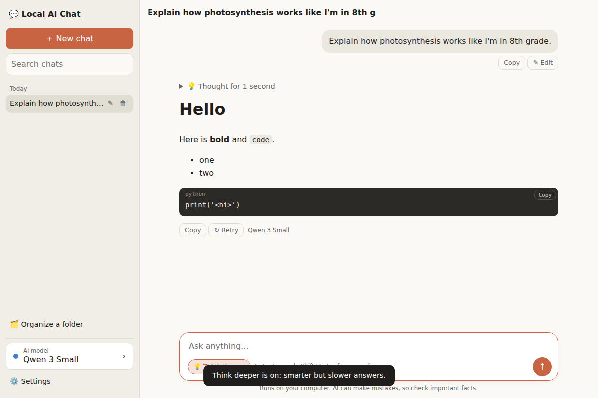

# Local AI Chat

A private AI assistant that runs entirely on your own computer and is used through a web page. Built for the Congressional App Challenge.

The AI model runs locally through [Ollama](https://ollama.com), so once a model is downloaded there is no internet connection, account or subscription needed, and your chats and files never leave your computer. The app checks your computer's memory and graphics card and picks a model that fits, from small laptops up to powerful desktops.



## What it can do

- **Chat** with a Claude-style assistant: streaming replies, an optional "Think deeper" mode, chat history with search, formatted answers and code blocks, light and dark themes.
- **Pick the right model automatically**: hardware detection recommends a model and locks ones that are too big, with downloads and per-model settings right in the app.
- **Coding help**: bigger coding requests switch to a coding model that fits your computer.
- **Folder Organizer**: the AI proposes how to tidy a messy folder; nothing changes until you press Apply, and every change can be undone.
- **Shared Files**: let the AI read and answer questions from folders you choose, and see which files it looked in.
- **Connectors**: plug in third-party tools through the Model Context Protocol (MCP), with an approval card before any tool runs.
- **Use it on your phone** over your home Wi-Fi after typing a pairing code.

Everything is written with only Python's standard library and plain JavaScript, so there is nothing to `pip install`.

## Quick start

1. Install **Python 3** from [python.org/downloads](https://www.python.org/downloads/) (on Windows, tick "Add python.exe to PATH").
2. Install **Ollama** from [ollama.com/download](https://ollama.com/download) and open it once.
3. Start the app:
   - **Windows:** double-click `chatbot/start-windows.bat`
   - **Mac:** double-click `chatbot/start-mac.command` (the first time, right-click it and choose **Open**)
   - **Any terminal:** `python3 chatbot/server.py`
4. Your browser opens **http://localhost:8000**. The setup guide downloads a model that fits your computer.

## Project layout

| Folder | What it is |
|---|---|
| [`chatbot/`](chatbot/README.md) | The main app: web server, chat page, hardware detection, model catalog, coding router and phone pairing |
| [`organizer/`](organizer/README.md) | Folder Organizer and Shared Files, loaded by the chatbot when this folder sits next to it |
| [`connectors/`](connectors/README.md) | MCP connectors so the AI can use third-party tools, with an example Notes server |

Each folder has its own README with details.

## How it works

```
Browser (web page)  <-->  chatbot/server.py (port 8000)  <-->  Ollama (port 11434)  <-->  AI model
```

The organizer and connectors folders plug into the chatbot's server, and their pages appear in the chat's sidebar. App settings are stored in `~/.local-ai-chat/` on your computer and chats in your browser, never in this repository.

## Running the tests

```
python3 -m unittest discover -s organizer -p "test_*.py"
python3 -m unittest discover -s connectors -p "test_*.py"
```
