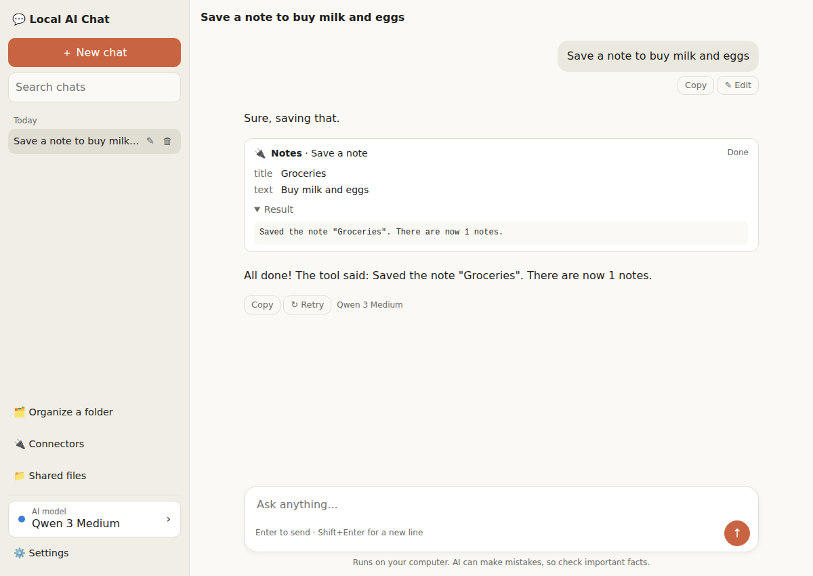
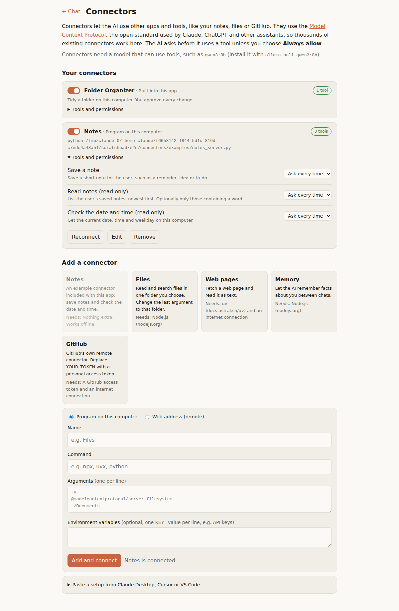

# Connectors

Connectors let the chatbot's AI use other apps and tools: your notes, files on your computer, web pages, GitHub and thousands more. They use the [Model Context Protocol](https://modelcontextprotocol.io) (MCP), the open standard that Claude, ChatGPT, Cursor and VS Code use for third-party tools, so a connector built for any of those works here too.

Like the rest of the app, this uses only Python's standard library. There is nothing to pip install.



## What it does

- **Connectors page** (sidebar → 🔌 Connectors): add, turn on/off, edit and remove connectors, and see each one's tools.
- **One-click presets**: Notes (included, works offline), Files, Web pages, Memory and GitHub.
- **Paste a setup**: paste the `{"mcpServers": {...}}` block from any connector's instructions for Claude Desktop, Cursor or VS Code.
- **Both kinds of connector**: a program on this computer (like `npx ...` or `uvx ...`), or a web address (remote, with an optional access token).
- **You stay in control**: when the AI wants to use a tool, a card shows what it wants to do, with **Allow once**, **Always allow** and **Deny**. Each tool can be set to *Ask every time*, *Always allow* or *Don't use* on the Connectors page.
- **Folder Organizer** shows up as a built-in connector, so you can say "tidy my Downloads folder" in the chat.
- Chats remember tool cards, so they're still there when you reopen a chat.



## Which model?

Connectors need a model that can use tools. In Ollama those are marked "tools", for example:

| Model | Install |
|---|---|
| Qwen 3 8B (recommended) | `ollama pull qwen3:8b` |
| Qwen 3 4B (8 GB computers) | `ollama pull qwen3:4b` |
| Llama 3.1 8B | `ollama pull llama3.1:8b` |

Gemma 3 can't use tools. If you chat with a model that can't, the app says so and answers without tools.

## Plug it into the chatbot

From this folder, run:

```
python add_to_chatbot.py --check     # see whether it fits the current chatbot
python add_to_chatbot.py             # make the changes
```

It makes small edits to `chatbot/server.py`, `chatbot/static/app.js` and `chatbot/static/index.html`, each marked with `connectors_routes` so running it twice does nothing. `connectors-plugin.patch` shows the same edits as a diff. Then restart the chatbot.

If the chatbot has changed so much that the script can't find where an edit goes, it names the spot. The edits by hand are:

**server.py**
1. Next to the organizer import, import `connectors_routes` from `../connectors` (in a `try`, set to `None` if missing).
2. At the top of `do_GET` and `do_POST`: `if connectors_routes and connectors_routes.handle(self): return`
3. In the chat route, after building the Ollama `payload`: `notices = connectors_routes.add_tools(payload, messages, capabilities(model))`. This adds the tools and keeps the tool messages in the history.
4. While streaming, collect `message.get("tool_calls")`. When Ollama says `done`, send each notice, and if there were tool calls, send `connectors_routes.tool_calls_event(tool_calls)`.

**index.html**: load `/connectors/tool-chat.css` and `/connectors/tool-chat.js` (before `app.js`), and add a sidebar link to `/connectors`.

**app.js**
1. In `renderMessages`, skip messages with `role: "tool"` and draw messages that have `tool_calls` with `ToolChat.savedTurn(m, renderMarkdown)`.
2. In `streamReply`, remember a `tool_calls` event's `calls`. After the stream ends, if there were calls, `await ToolChat.runCalls({...})`, and if it returns true, call `streamReply(chat)` again so the model can use the results.

## How it works

```
Chat page ── /api/chat ──> server.py ──> Ollama (with the tools' descriptions)
    │                                       │
    │ <── "tool_calls" event ───────────────┘  the model asks for a tool
    │
    ├─ shows a card, user presses Allow
    ├─ /api/tools/call ──> connectors.py ──> the connector (MCP server) ──> result
    └─ sends the chat again with the result ──> the model writes its answer
```

| File | What it is |
|---|---|
| `mcp_client.py` | A small MCP client: starts local connector programs (stdin/stdout) or talks to remote ones (Streamable HTTP) |
| `connectors.py` | The list of connectors and their settings, the presets, and the hooks the chat server calls |
| `connectors_routes.py` | The web routes for the Connectors page and for running a tool |
| `static/connectors.*` | The Connectors page |
| `static/tool-chat.*` | Tool cards and the allow/deny flow on the chat page |
| `examples/notes_server.py` | A complete example connector in one file, to show how anyone can build one |
| `add_to_chatbot.py` | Plugs this folder into the chatbot |
| `test_connectors.py` | Tests: `python -m unittest test_connectors` |

Settings are saved in `~/.local-ai-chat/connectors.json` in the same `mcpServers` format other apps use. Tool results are cut to 6,000 characters so they fit in a small model's memory.

## Safety

- Connectors can run programs, so only the app's own page can add or use them: the server only listens on this computer, and it refuses requests from other websites (it checks the `Host` and `Origin` of every request).
- Nothing runs without your OK unless you chose **Always allow** for that tool.
- Only add connectors from people you trust, just like installing any app.
- Remote connectors that need a full sign-in (OAuth) aren't supported yet; ones that take an access token are.

## Tested

- The unit tests pass (11 tests, using the Notes example).
- Real third-party connectors worked: the official Files connector (`@modelcontextprotocol/server-filesystem` via npx), the Time connector (`mcp-server-time` via uvx), and the official test server over a web address (Streamable HTTP).
- In a browser with a stand-in for Ollama: adding Notes from the presets, Allow once, Always allow (no card the next time), Deny, Stop while a card is waiting, reopening a chat with tool cards, the notice for a model without tools, dark mode and phone width. A real model (Ollama with qwen3) hasn't been tried yet, because Ollama can't run where this was built.
