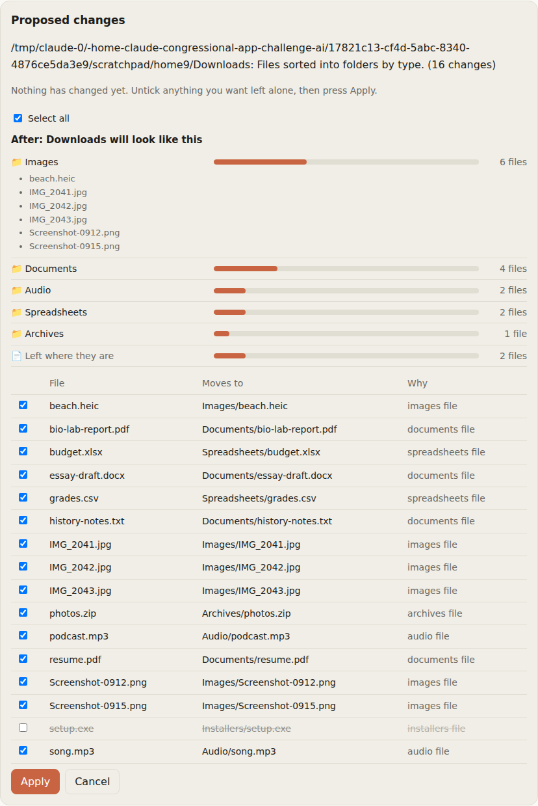

# Folder Organizer

Lets the local AI tidy a messy folder, like the Desktop or Downloads.

1. You pick a folder (and optionally say how you want it organized).
2. The local model looks at the file names, sizes and dates and proposes a plan of moves and renames.
3. You review the plan on a web page and untick anything you want left alone. **Nothing changes on disk until you press Apply.** An **After** preview above the list shows how the folder will look, and updates as you tick and untick files.

   

4. Every applied change is logged, so **Undo** puts every file back where it was.

If Ollama isn't running, or the model gives an answer that doesn't make sense, it falls back to sorting files into folders by type (Images, Documents, Installers and so on).

Like the chatbot, it uses only Python's standard library. Nothing to install.

## Safety rules

These are enforced in code, whatever the model suggests:

- Files are only moved or renamed. Nothing is ever deleted or overwritten (a name clash becomes `report (2).pdf`).
- Every destination must stay inside the chosen folder. Suggestions that point anywhere else are dropped and shown under "Suggestions that were ignored for safety".
- Renames keep the original file extension, so files still open in the right app.
- The home folder itself, system folders and the top of a drive are refused.
- Only files sitting directly in the folder are considered; existing subfolders and hidden files are left alone.
- The page only accepts changes from the app's own page, not from other websites.

Plans and undo logs are saved in `~/.local-ai-chat/organizer/` (change it with the `ORGANIZER_DATA_DIR` environment variable).

## Try it on its own

```
python run.py
```

Then open http://localhost:8001/organizer or http://localhost:8001/files.

## Plug it into the chatbot

The chatbot's `server.py` already loads `organizer_routes.py` when `organizer/` sits next to `chatbot/`, which adds the `/organizer` and `/files` pages and their `/api/...` endpoints. The remaining chat changes for Shared Files are in [CHATBOT_INTEGRATION.md](CHATBOT_INTEGRATION.md).

# Shared Files

Lets the user share folders (like the Desktop) so the AI can answer questions about their files and make better organizing plans. Open `/files` to share a folder.

- **Opt-in per folder.** Nothing is read until a folder is shared, and "Stop sharing" deletes everything read from it.
- **Read-only and local.** Answering questions never changes a file, and the text only goes to the local Ollama model.
- **Private-looking files are skipped:** names with "password", "secret", "id_rsa", ".env", and key or wallet files are listed by name only and never read.
- **What it reads:** Word (.docx), PowerPoint (.pptx), Excel (.xlsx), OpenDocument, PDF, notebooks, and plain text and code files. Pictures, videos and apps are listed by name only.
- **PDFs:** a simple built-in reader handles basic PDFs. Many PDFs exported from Word or Google Docs store text in a way it can't decode, so installing the optional `pypdf` package (`pip install pypdf`) makes PDF reading much more reliable. It is used automatically when present.
- **How answers find the right file:** each file is split into short passages and ranked against the question with BM25, the classic search-engine formula. The best passages (about 4,000 characters) go to the model with the question. File names count extra, since they are often the best clue.
- **Staying up to date:** shared folders are re-checked at most once a minute when a chat message arrives; only new or changed files are re-read.
- **Limits:** 3,000 files and 4 subfolders deep per shared folder, 25 MB and 20,000 characters per file.
- **Organizer:** when a folder being organized is shared, the plan prompt includes the start of each file's text, so the model can turn "Untitled 3.docx" into "History essay - The New Deal.docx".

The index lives in `~/.local-ai-chat/organizer/files/`.

## Next step: asking for it in chat

`organizer.py` already has what the chatbot needs to offer this as a tool the model can call ("tidy my Desktop"):

- `TOOL_SPEC` goes in the `tools` list of Ollama's `/api/chat` request.
- `handle_tool_call(arguments, model)` makes the plan and returns text for the model plus the plan. The chat page then shows a link to `/organizer?plan=<id>`, where the user reviews and applies it.

One catch: `gemma3:4b` (the chatbot's default) doesn't support Ollama tool calling. Models that do include `qwen3:4b` and `llama3.2:3b`. So the chat side needs either a tool-capable model, or a simpler trigger such as a `/organize ~/Desktop` command typed in chat.

## Files

| File | What it does |
| --- | --- |
| `organizer.py` | Scanning, planning (with the model), applying, undoing, and the chat tool definition |
| `organizer_routes.py` | The web endpoints, written so the chatbot server can reuse them |
| `static/` | The review page |
| `shared_files.py` | Sharing folders, reading file text, searching it, and building chat context |
| `run.py` | Runs the organizer and Shared Files pages on their own for testing |
| `test_organizer.py`, `test_shared_files.py` | Tests (`python -m unittest`); they use throwaway folders and a fake model |
| `CHATBOT_INTEGRATION.md` | The chat changes that let answers use shared files |
